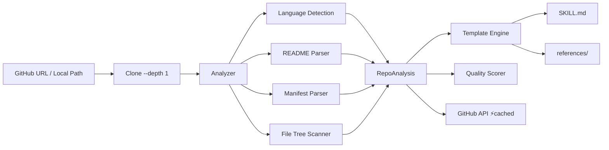

<p align="center">
  
</p>

<h1 align="center">repo2skill</h1>

<p align="center">
  <strong>Convert any GitHub repo into an AI agent skill. One command. No LLM.</strong>
</p>

<p align="center">
  <a href="https://www.npmjs.com/package/repo2skill"></a>
  <a href="https://github.com/NeuZhou/repo2skill/actions/workflows/ci.yml"></a>
  <a href="https://opensource.org/licenses/MIT"></a>
  <a href="https://github.com/NeuZhou/repo2skill"></a>
</p>

<p align="center">
  <a href="#-quick-start">Quick Start</a> •
  <a href="#-features">Features</a> •
  <a href="docs/cli-reference.md">CLI Reference</a> •
  <a href="docs/templates.md">Templates</a> •
  <a href="docs/configuration.md">Configuration</a>
</p>

---

**repo2skill** analyzes any GitHub repository — README, manifests, source files, project structure — and generates a ready-to-use [OpenClaw](https://openclaw.com) `SKILL.md` with reference files. Pure heuristic analysis. Fast, deterministic, offline-capable. **No LLM required.**

## ⚡ Quick Start

```bash
npm install -g repo2skill

repo2skill sindresorhus/got
# → ./skills/got/SKILL.md ✅
```

```
🔍 Cloning https://github.com/sindresorhus/got...
🧠 Analyzing repository...
🛠️ Generating skill...

✅ Skill generated: ./skills/got
   SKILL.md: ./skills/got/SKILL.md
   References: 2 file(s)
```

## ✨ Features

| Feature | Description |
|---------|-------------|
| 🧠 **Smart README Parsing** | Extracts descriptions, usage examples, API docs, install instructions |
| 🌐 **16 Languages** | JS/TS, Python, Rust, Go, Java, Kotlin, Ruby, C/C++, PHP, Elixir, Swift, Dart, Zig, Lua, Haskell, Scala |
| 🎯 **Trigger Phrase Gen** | Auto-generates "when to use" and trigger phrases for skill matching |
| 📦 **Batch Mode** | Process dozens of repos from a file with `--batch` + `--parallel` |
| 📄 **Templates** | `minimal`, `detailed`, `security`, `default` — control output detail |
| 🔄 **Upgrade Mode** | `--upgrade` regenerates skills while preserving `<!-- manual -->` sections |
| 📊 **Quality Scoring** | 0-100 score with `--min-quality` filtering |
| 🔀 **Diff Mode** | `--diff` compares existing SKILL.md against latest repo state |
| 🐙 **GitHub Integration** | Stars, forks, topics, releases via API (cached) |
| 📝 **Lint & Validate** | `lint` and `validate` subcommands for SKILL.md quality |
| 🔍 **Compare** | Side-by-side repo comparison |
| 🗂️ **Registry** | Track and bulk-update generated skills |
| 📋 **Structured Output** | `--format json\|yaml` for programmatic use |
| 🐳 **Docker Detection** | Extracts base image, ports, entrypoint |
| 📈 **Dependency Report** | `--show-deps` analyzes project dependencies |
| 🏷️ **Version Pinning** | `--version-tag` pins skills to git tags |
| 🚀 **Publish** | `--publish` pushes to ClawHub in one command |
| 🎮 **Interactive Mode** | `-i` guided step-by-step |
| ⚡ **Cached API** | In-memory + disk cache for GitHub API (v3.0) |

## 🏗️ Architecture



1. **Clone** — shallow clone (`--depth 1`)
2. **Detect** — identify languages from extensions and manifests
3. **Parse** — extract metadata from README, package.json/Cargo.toml/go.mod/etc.
4. **Analyze** — detect CLI commands, Docker, monorepo, tests, CI
5. **Generate** — produce `SKILL.md` with frontmatter, triggers, quick start
6. **Score** — rate quality (0-100) based on completeness

## 📖 Usage Examples

```bash
# GitHub URL or owner/repo shorthand
repo2skill https://github.com/BurntSushi/ripgrep
repo2skill sindresorhus/got

# Local directory (no clone)
repo2skill --local ./my-project

# Dry run preview
repo2skill sindresorhus/got --dry-run

# Different templates
repo2skill sindresorhus/got --template minimal
repo2skill sindresorhus/got --template security

# JSON output
repo2skill sindresorhus/got --json | jq '.features'

# Batch conversion (parallel)
repo2skill --batch repos.txt --parallel 4 --min-quality 60

# Monorepo package targeting
repo2skill vercel/turborepo --package packages/turbo

# Upgrade existing skill
repo2skill --upgrade ./skills/got

# Diff against existing
repo2skill sindresorhus/got --diff ./skills/got/SKILL.md

# Generate + publish
repo2skill sindresorhus/got --publish
```

## 📤 Example Output

`repo2skill BurntSushi/ripgrep` produces:

```
skills/ripgrep/
├── SKILL.md
└── references/
    ├── README.md
    └── api.md
```

Generated `SKILL.md`:

```markdown
---
name: ripgrep
description: >-
  ripgrep recursively searches directories for a regex pattern
  while respecting your gitignore. WHEN: search files, find in code,
  run rg commands.
---

# ripgrep

ripgrep recursively searches directories for a regex pattern
while respecting your gitignore.

## When to Use
- Run `rg` commands
- Search through files or text
- Fast recursive grep with gitignore support

## Quick Start
​```bash
cargo install ripgrep
rg "pattern" /path/to/search
​```

## Project Info
- **Language:** Rust
- **License:** Unlicense/MIT
- **Tests:** Yes
```

## 🌍 Supported Languages

| Language | Manifest | Extracted |
|----------|----------|-----------|
| Node.js / TypeScript | `package.json` | name, description, bin, deps, license |
| Python | `pyproject.toml`, `setup.py` | name, description, CLI scripts |
| Rust | `Cargo.toml` | name, binary targets, license |
| Go | `go.mod` | module name, dependencies |
| Java / Kotlin | `pom.xml`, `build.gradle(.kts)` | artifact info, deps |
| Ruby | `Gemfile`, `*.gemspec` | gem name, executables |
| C/C++ | `CMakeLists.txt`, `Makefile` | project name, targets |
| PHP | `composer.json` | name, description, deps |
| Elixir | `mix.exs` | app name, version |
| Swift | `Package.swift` | targets, dependencies |
| Dart, Zig, Lua, Haskell, Scala, C# | various | basic detection |

## ⚔️ repo2skill vs Alternatives

| | **repo2skill** | Manual Writing | LLM-based |
|---|---|---|---|
| ⏱️ Speed | ~10 seconds | 15-30 minutes | 30-60 seconds |
| 🎯 Accuracy | Deterministic | Varies by author | Hallucination risk |
| 💰 Cost | Free | Free (your time) | API costs |
| 🔒 Privacy | Offline-capable | N/A | Sends code to API |
| 📦 Batch | ✅ Parallel | Manual | Manual |
| 🔄 Reproducible | 100% | No | No |
| 🌐 Languages | 16 | You decide | Varies |

## 📊 150+ Converted Examples

All in [`examples/`](./examples):

| Repo | Language | Category |
|------|----------|----------|
| [BurntSushi/ripgrep](https://github.com/BurntSushi/ripgrep) | Rust | CLI Tool |
| [sindresorhus/got](https://github.com/sindresorhus/got) | TypeScript | Library |
| [tiangolo/fastapi](https://github.com/tiangolo/fastapi) | Python | Framework |
| [gin-gonic/gin](https://github.com/gin-gonic/gin) | Go | Framework |
| [facebook/react](https://github.com/facebook/react) | JavaScript | Framework |
| [prisma/prisma](https://github.com/prisma/prisma) | TypeScript | Library |
| [hashicorp/terraform](https://github.com/hashicorp/terraform) | Go | DevOps |
| [redis/redis](https://github.com/redis/redis) | C | Database |
| ... [and 142 more](./examples) | | |

## 🔌 Use as OpenClaw Skill

```bash
clawhub install repo2skill
```

Then ask your agent: *"Convert sindresorhus/got into a skill"*

## 📚 Documentation

- [CLI Reference](docs/cli-reference.md) — all commands and flags
- [Templates](docs/templates.md) — template system guide
- [Configuration](docs/configuration.md) — env vars, quality scoring, batch format

## 🤝 Contributing

See [CONTRIBUTING.md](CONTRIBUTING.md).

## 🔗 Ecosystem

| Project | Description |
|---------|-------------|
| [AgentProbe](https://github.com/NeuZhou/agentprobe) | 🔬 Playwright for AI Agents — testing & observability |
| [ClawGuard](https://github.com/NeuZhou/clawguard) | 🛡️ AI Agent Security Scanner |
| [FinClaw](https://github.com/NeuZhou/finclaw) | 📈 AI-Powered Quantitative Finance |

## 📄 License

MIT © [Kang Zhou](https://github.com/NeuZhou)
